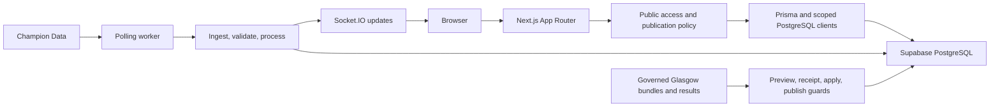

# CentrePass architecture

Status: current as of 2026-07-24. Verified against
`main@da2f523e23dcaf89a56976fbc7dc5591963d3226`.

## Product and runtime

CentrePass is a multi-competition netball results application. It serves live
scores, fixtures, results, standings, brackets, teams, players, rankings,
records, comparisons, and deterministic statistical questions.

| Layer | Current implementation |
| --- | --- |
| Web | Next.js 16.2.11 App Router and React 19 |
| Server | Custom Express 5 launcher with Socket.IO 4 |
| Runtime | Node.js 24.14.1 |
| Data | Supabase PostgreSQL through Prisma 6.19.3 |
| Authentication | NextAuth 4 with Prisma adapter |
| Styling | Tailwind CSS 4 |
| Hosting | Render Starter service in Oregon |
| Testing | Vitest, Testing Library, production smoke scripts, and Playwright browser monitoring |

`package.json`, `render.yaml`, `prisma/schema.prisma`, and the route files under
`src/app/` are the source of truth for versions and topology.

## Runtime flow



The custom launcher prepares Next before loading Socket.IO and the worker. A
normal local start is read-only in the background because
`WORKER_ENABLED=false` by default. Production requires the worker and reports
its freshness through readiness.

## Competition and publication model

The primary domain hierarchy is:

```text
CompetitionSeries
└── Competition (an edition/season)
    ├── Stage
    │   ├── StageGroup
    │   └── StageStanding
    ├── EditionEntry
    │   └── RosterMembership
    ├── Match
    │   ├── MatchSlot
    │   ├── MatchQuarter
    │   ├── PlayerMatchStats
    │   ├── TeamMatchStats
    │   ├── ScoreFlow
    │   └── MatchEvent
    └── DataCoverage
```

`CompetitionSeries` represents a competition identity. `Competition`
represents one edition and carries publication state, rules, time-zone, source
identity, and readiness inputs. Public routes never rely on a slug alone:
publication, stage visibility, import status, entry/match topology, and
capability coverage are evaluated before data is exposed.

Missing capability data remains unavailable. It must not be converted to a
zero statistic.

## Data sources and ingestion

### Champion Data worker

The worker fetches SSN fixture and match data, records bounded source evidence
in `PollLog`, validates and transforms it, writes canonical match state, and
broadcasts deltas through Socket.IO. The main modules are:

- `src/lib/worker.ts`
- `src/lib/ingestion.ts`
- `src/lib/processing.ts`
- `src/lib/broadcasting.ts`
- `src/lib/live-state.ts`
- `src/lib/worker-health.ts`

TheSportsDB is an optional enrichment source for team and player media and
biographical fields.

### Governed imports

Provider-neutral source adapters resolve external identities before a
transactional writer changes canonical data. Import runs preserve source
snapshots, mappings, validation issues, mutation rows, checksums, and coverage
declarations.

Glasgow 2026 uses the stricter manual workflow documented in the Glasgow
runbooks. Production mutations require a fresh action-bound target guard,
private refs-only evidence, a matching recorded preview, and explicit
confirmation. Publication is separate from import.

## Public application surfaces

- `/` — edition-aware fixtures and results.
- `/live` and `/match/[matchId]/live` — live hub and live match experience.
- `/match/[matchId]` and `/match/[matchId]/court` — result and court views.
- `/competitions/[competitionSlug]/[editionSlug]/*` — canonical edition,
  pools, standings, bracket, and teams.
- `/standings` — legacy convenience resolver that redirects or renders the
  current public edition context.
- `/rankings`, `/records`, `/compare/players`, `/explore` — analytics and
  deterministic statistical-query surfaces.
- `/team/[teamSlug]`, `/player/[playerId]`, `/teams` — profiles/directories.
- `/auth/*` and `/settings` — authentication and private personalization.
- `/admin/preview/glasgow-2026` — fail-closed, allowlisted, bounded DRAFT QA.
- `/admin/sim` — local-development simulation only.

The API surface includes health, readiness, worker health, public matches,
live status, bounded search, deterministic stats queries, and private
user-resource endpoints.

## Analytics and Ask CentrePass

Analytics run in a private `analytics` PostgreSQL schema. The application uses
two separate scoped credentials:

- a read-only analytics role with an exact view allowlist; and
- an operations role that can execute only the rate-limit and telemetry
  functions.

Ask CentrePass is deterministic. User text is parsed into the finite
`QuerySpecV1` contract and executed against allowlisted metrics, dimensions,
aggregations, and entities. It does not generate SQL from user text and has no
LLM fallback. Request size, result size, statement time, and rate limits are
bounded.

Supabase's Data API exposure settings, PostgreSQL grants, and RLS are separate
controls. CentrePass does not expose the private analytics schema through the
Data API. Public-schema objects retain explicit least-privilege grants and RLS
where browser/Data API access is intended.

## Caching and performance boundaries

- Changing live state remains request-fresh and fail-closed.
- Public edition/readiness policy is evaluated before cached tournament data.
- Rankings and records use bounded snapshots with explicit cache epochs and
  size limits.
- Canonical tournament standings use a short tagged stale-while-revalidate
  cache behind a fresh policy gate.
- Client navigation gives immediate pending feedback and limits expensive
  prefetching to explicit intent.
- Server operations, named phases, database queries, client navigation, and
  RSC traffic are measured separately.

See [performance.md](performance.md) and the two performance runbooks for the
current evidence and regression gates.

## Deployment and operations

Render builds with `npm ci && npm run build`, runs guarded Prisma migrations in
the pre-deploy step, and starts `server.ts`. Pull-request previews must skip
production migrations. `/api/health` is process liveness and carries the
release SHA; `/api/readiness` verifies database, configuration, scoped roles,
and worker health.

The checked-in Blueprint keeps analytics and Ask disabled by default. A
production operator may enable them only after their scoped role and readiness
checks pass.

Operational detail belongs in [`runbooks/`](runbooks/), not in this overview.

## Sources of truth

| Question | Authoritative source |
| --- | --- |
| Dependency/runtime version | `package.json`, `package-lock.json`, `render.yaml` |
| Database shape | `prisma/schema.prisma` and `prisma/migrations/` |
| Routes | `src/app/` |
| Feature/config validation | `src/lib/runtime-environment.ts`, `src/lib/server-feature-flags.ts` |
| Public data policy | `src/lib/public-match.ts`, `src/lib/public-team.ts`, `src/lib/edition-publication-readiness.ts` |
| Navigation policy | `src/lib/navigation.ts` |
| Production state | exact `/api/health`, `/api/readiness`, Render deployment, and Supabase evidence |
| Historical rationale | Git history and explicitly labelled files in `docs/history/` |
