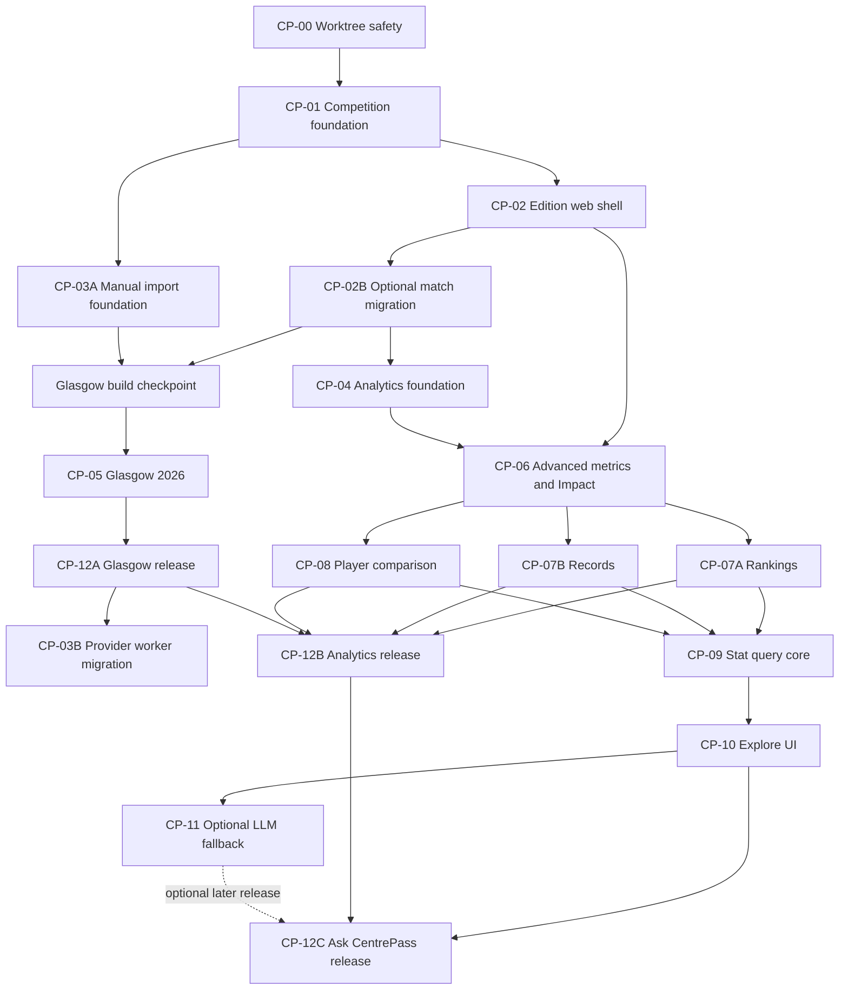

# CentrePass Multi-Competition, Analytics, and Stat Search Plan

**Status:** Ready for CP-00 and CP-01; Glasgow publication remains gated by official source/licensing verification

**Prepared:** 15 July 2026

**Baseline:** `main` at `3d53a07`; `npm run check` passes with 64 test files and 282 tests, `npx prisma validate` passes, and `npm run build` passes on Next.js 16.2.10.

**Goal:** Evolve CentrePass from an SSN-specific application into a competition-independent netball platform, launch Glasgow 2026 coverage through a reusable source pipeline, add the full Phase 2 analytics product, and then add a safe StatMuse-style natural-language stats experience.

**Out of scope:** Predictions, fantasy products, a new live visualizer, paid tiers, and arbitrary LLM-generated SQL.

**Research note:** Tournament dates, schedule details, source availability, licensing, branding rights, and competition regulations from the supplied research must be re-verified against official sources before data is imported or published. This plan does not treat an undocumented browser endpoint as an authorized feed.

---

## Executive decision

This should be delivered as three release trains, not one large branch:

1. **Competition and Glasgow MVP** — competition model, source adapters, competition UI, pools, schedule, rosters, results, and honest data-capability states.
2. **Analytics product** — advanced metrics, CentrePass Impact, rankings, comparisons, and coverage-labelled records, released independently after the Glasgow MVP.
3. **Ask CentrePass** — deterministic natural-language parsing first, released after the analytics services, with an optional LLM fallback only after evaluation proves it adds value.

The supplied research places the Glasgow netball start close to the current date. That makes schedule/results coverage the only sensible tournament-launch target. Phase 2 analytics and natural-language search must not be allowed to destabilize the core Glasgow release.

The work must use dependency-ordered worktrees. Do not create all worktrees from the current `main`; downstream worktrees must be created from the merge commit containing their prerequisites.

One non-code task starts immediately in parallel: confirm the official Glasgow schedule/regulations and request authorized results-data access. It does not need a worktree because it must not mutate the repository. Its output is a written source contract covering fields, update cadence, attribution, retention, redistribution, branding, and fallback/manual-entry rights. CP-05 cannot publish imported data until that gate is satisfied.

---

## Verified current state

The existing application has several reusable foundations, but its domain model is still SSN-specific:

- `Competition` currently combines an edition name, year, dates, and a mandatory unique Champion Data ID. It behaves like “SSN 2026,” not a stable competition identity. See `prisma/schema.prisma:13`.
- `Team` belongs to exactly one competition, and `Player` belongs to exactly one team. This cannot model a national team across editions or a player with concurrent club and international memberships. See `prisma/schema.prisma:25` and `prisma/schema.prisma:83`.
- `Match` requires an integer round and concrete home/away teams. There are no pools, stage-scoped standings, neutral-side semantics, or unresolved knockout participants. See `prisma/schema.prisma:112`.
- The edition resolver accepts only a year. Two competitions with a 2026 edition would be ambiguous. See `src/lib/competitions.ts:33`.
- The worker polls two hard-coded SSN Champion Data IDs and resolves all identities through global Champion Data columns. See `src/lib/worker.ts:48`.
- Standings are hard-coded to SSN’s 4/2/0 calculation and exclude finals through `finalCode`. See `src/lib/standings.ts:13`.
- Player and team stat fields default to zero, and shared stat utilities also coerce missing values to zero. Without a coverage layer, unavailable international data would produce false zeroes, rankings, and records. See `prisma/schema.prisma:156` and `src/lib/stat-utils.ts:27`.
- The existing “Impact” is an unversioned, position-insensitive sum inside the player page. It must not be promoted as CentrePass’s cross-competition rating. See `src/app/player/[playerId]/page.tsx:67`.
- `/api/search` is entity autocomplete for players, teams, and matches. It should remain separate from natural-language statistical querying. See `src/app/api/search/route.ts:10`.
- Every development server starts the polling worker. Multiple worktrees connected to one database would therefore write concurrently. See `server.ts:42`.
- Production simulation filtering relies on `round != 99`. Making tournament rounds nullable would cause SQL null-semantics bugs, so simulation needs an explicit flag before the round field changes. See `src/lib/db.ts:9`.
- `prisma/seed.ts` is destructive and deletes application data, including personalization records. It must not become the Glasgow import mechanism. See `prisma/seed.ts:61`.
- Supabase Data API access is explicitly denied and RLS is enabled on current tables. Every new public-schema table must receive the same treatment. See `prisma/migrations/20260712010000_harden_public_schema/migration.sql:7`.

Reusable components and patterns include `ScoreCard`, `TeamBadge`, `PlayerAvatar`, `MatchTabs`, `MatchStatsComparison`, the cached query helpers, server timing, Socket.io delivery, typed player/team match stats, and Recharts. No new frontend framework or chart library is required.

---

## Target architecture

### Domain hierarchy

The public domain language should be:

```text
Competition
  -> Edition
       -> Ruleset
       -> Entries
            -> Team
            -> Roster memberships
       -> Stages
            -> Groups
            -> Matches
                 -> Slots/sides
                 -> Periods
                 -> Stats/events
```

Examples:

```text
Suncorp Super Netball
  -> 2026
       -> Regular Season
       -> Finals

Commonwealth Games Netball
  -> Glasgow 2026
       -> Pool Stage
            -> Pool A
            -> Pool B
       -> Classification
       -> Semi-finals
       -> Medal Matches
```

### Zero-downtime physical transition

The clean target uses separate competition and edition concepts, but production should use an expand-and-contract migration:

1. Add `CompetitionSeries` as the stable parent while keeping the current `Competition` row functioning as the legacy edition record.
2. Add edition fields to the current row: stable slug, label, timezone, ruleset, publication state, and parent series.
3. Add canonical entry/membership/source models and backfill SSN.
4. Switch consumers to compatibility projections that tolerate optional tournament participants and rounds.
5. In a second, sole-owner migration, relax legacy match columns and dual-write legacy/canonical relations.
6. Switch remaining reads page by page to an application-level `Edition` contract.
7. Rename the legacy physical model and remove old columns only in a later contract migration, after all reads and writes have moved.

Do not rename the live `Competition` table in the first release. Render runs migrations before replacing the old process, so a destructive rename could break the still-serving old release during deployment.

### New foundational records

The additive foundation should include:

- `CompetitionSeries`
- `Ruleset`
- `Stage`
- `StageGroup`
- `StageStanding`
- `EditionEntry`
- `RosterMembership`
- `MatchSlot`
- `SourceSystem`
- `EditionSource`
- `SourceEntityMapping`
- `ImportRun`
- `ImportIssue`
- `ImportMutation`
- `SourceSnapshot`
- `DataCoverage`
- `PlayerAlias`
- `TeamAlias`

The current records should be extended rather than removed:

- Current `Competition`: parent series, edition slug/label, source timezone, ruleset, and publication state are added in CP-01; `championDataId` becomes nullable/deprecated only in CP-02B after consumers stop assuming it is present.
- `Team`: becomes canonical; legacy `competitionId` remains temporarily while `EditionEntry` becomes authoritative.
- `Player`: becomes canonical; legacy `teamId` remains temporarily while `RosterMembership` becomes authoritative.
- `Match`: stage/group, optional round number, round label, neutral venue, provider-neutral fixture lifecycle, result quality status, source timestamps, and explicit `isSimulation`.
- Existing `homeTeamId` and `awayTeamId`: remain required during CP-01. After CP-02 switches consumers to optional side projections, CP-02B makes them nullable compatibility fields. Existing SSN rows remain fully populated, and unresolved rows are not published until the capability-aware application is deployed.
- Existing `Standing`: remains for SSN compatibility while new stage/group-scoped standings become authoritative for tournament pools.

All new foreign keys need indexes. Multi-column indexes should follow actual filters, with equality columns before date/range columns. Schema constraints and source mappings must make idempotent upserts possible.

### Match slots and neutral venues

Do not create a team named `TBC`. Each match has two ordered slots whose source is one of:

```text
TEAM
GROUP_RANK
MATCH_WINNER
MATCH_LOSER
UNRESOLVED
```

A slot may resolve to an edition entry later. Existing UI can continue receiving `homeTeam` and `awayTeam` compatibility projections, but neutral tournament pages should display listed side A/side B semantics and must not claim home advantage.

### Rules and data coverage are separate

Rules describe what the competition permits. Coverage describes what CentrePass actually received.

Example ruleset fields:

```text
period count
regulation period length
extra-time policy
scoring model
standings strategy key
super-shot availability
```

Example coverage capabilities:

```text
FINAL_SCORE
PERIOD_SCORES
TEAM_BOX_SCORE
PLAYER_BOX_SCORE
SCORE_FLOW
MATCH_EVENTS
SUBSTITUTIONS
NET_POINTS
SUPER_SHOTS
LINEUPS
```

Each capability needs a state such as `AVAILABLE`, `PARTIAL`, `PROVISIONAL`, or `UNAVAILABLE`, scoped at edition and optionally match level.

Fixture lifecycle and result quality are different fields. The normalized fixture lifecycle must cover at least `SCHEDULED`, `DELAYED`, `LIVE`, `COMPLETED`, `POSTPONED`, `CANCELLED`, and `ABANDONED`; result quality separately tracks states such as provisional, official-final, and corrected.

Existing zero-default stat columns may remain during the expand phase, but no consumer may interpret a value until its capability is available. A later contract migration can make provider-optional fields nullable after the TypeScript consumers are ready.

### Provider-neutral ingestion

The normalized source boundary should look like:

```ts
interface CompetitionSourceAdapter {
  sourceKey: string;
  capabilities: SourceCapability[];
  fetchEdition(context: SourceContext): Promise<EditionInput>;
  fetchTeams(context: SourceContext): Promise<TeamInput[]>;
  fetchRosters(context: SourceContext): Promise<RosterInput[]>;
  fetchSchedule(context: SourceContext): Promise<MatchInput[]>;
  fetchMatchSummary?(context: MatchSourceContext): Promise<MatchSummaryInput>;
  fetchBoxScore?(context: MatchSourceContext): Promise<BoxScoreInput>;
  fetchEvents?(context: MatchSourceContext): Promise<MatchEventInput[]>;
}
```

The processing flow is:

```text
fetch
  -> retain permitted raw snapshot/checksum
  -> validate source schema
  -> normalize
  -> resolve canonical identities
  -> preview unresolved entities
  -> idempotent upsert
  -> reconcile
  -> publish capability state
  -> refresh analytics/cache
```

`ChampionDataAdapter` should wrap the current Champion Data transport first. The worker should discover enabled `EditionSource` records rather than reading only SSN environment IDs. External identifiers must be strings and unique within `(source system, entity type, external ID)`, never globally across providers.

Operational polling logs and durable provenance are different records. Short-lived `PollLog` retention can continue, while `ImportRun` and `SourceSnapshot` provide replay and audit history subject to the source licence’s storage terms.

### Analytics contract

Every analytics product must consume one shared result shape:

```text
metric ID
value or unavailable
unit and aggregation
edition/stage/group/window
games and minutes
minimum sample result
coverage status
formula version
as-of timestamp
included match IDs
```

Create a versioned TypeScript metric catalogue containing:

```text
slug and aliases
display name and definition
entity type
unit
allowed aggregations
required raw fields/capabilities
position compatibility
minimum sample
higher-is-better
formula version
```

Executable calculations remain in reviewed TypeScript or SQL. A database row or LLM must never provide arbitrary formula SQL.

Use a private, unexposed `analytics` Postgres schema for reviewed fact/summary views. Revoke `anon` and `authenticated`; use a dedicated server-side read-only role with `SELECT` only, read-only transactions, and a short statement timeout. If any view is ever exposed, use security-invoker behavior and re-run the Supabase security checks.

Start with indexed views/queries and measured caching. Introduce materialized views only where `EXPLAIN ANALYZE` proves that persisted summaries are needed. Completed-match finalization should invalidate affected summaries and query caches.

### CentrePass Impact

The existing page-local Impact value must be removed or relabelled before the new rating ships.

CentrePass Impact v1 should:

1. Calculate per-60 contributions.
2. Compare players within a compatible position group and competition population.
3. Standardize positive and negative inputs.
4. Apply minimum minutes and sample shrinkage.
5. Treat unavailable fields as unavailable, not zero.
6. Store/display the formula version, population, minutes, and percentile.

Official Net Points remains a source-specific metric. CentrePass Impact must never be labelled Net Points or presented as an official award.

### Rankings, comparisons, and records

Rankings must be scoped by competition type, edition, position, and time window. Never combine clubs and national teams into one population.

Comparison must show only compatible metrics and must disclose games, minutes, included matches, unequal sample sizes, and formula versions. Cross-position comparison should lead with percentiles, not raw totals.

Records require explicit scopes such as single match, edition, finals, career, team, and CentrePass data era. Until coverage is complete, use wording such as “highest recorded by CentrePass since …”, never “all-time.”

### Ask CentrePass architecture

Keep `/api/search` as fast entity autocomplete. Add a separate page and endpoint:

```text
GET  /explore
POST /api/stats/query
```

The v1 pipeline is deterministic:

```text
question
  -> input policy
  -> normalization
  -> entity/alias candidates
  -> metric aliases
  -> rule parser
  -> clarification or QuerySpecV1
  -> schema and coverage validation
  -> allowlisted query plan
  -> read-only analytics views
  -> deterministic answer/table/chart
```

`QuerySpecV1` should use finite enums and canonical IDs for:

- intent: lookup, leaderboard, comparison, or record
- subject: player or team
- registered metric IDs
- aggregation: total, per game, per 60, maximum, or percentage
- edition, stage, group, opponent, and completed-status filters
- window: edition, last N completed matches, or date range
- grouping, ordering, minimum minutes, and bounded limit

The parser result is one of `ready`, `needs_clarification`, or `unsupported`. “Best” without a metric and “average” without a statistic must clarify rather than guess.

No user text or model output may select arbitrary tables, columns, SQL functions, or sort expressions. The compiler maps an allowlisted metric/spec combination to reviewed query functions or controlled `Prisma.sql` fragments, with user data only in parameters.

An LLM interpreter is optional and comes later. It receives the question plus shortlisted entities, metric definitions, and allowed enums; it returns schema-constrained JSON and passes through the same validator/compiler. It never receives database credentials or a SQL tool.

Do not plan to co-host Ollama in the existing Render starter service, which already contains the web server and polling worker. A local model would need a separately measured service. The rules-only product has no per-query model charge and is the recommended first public release.

---

## Worktree delivery plan

### Dependency graph



### Worktree summary

| ID | Branch | Depends on | Primary outcome |
|---|---|---|---|
| CP-00 | `feature/worktree-dev-safety` | Current main | Secondary worktrees cannot start a live writer accidentally |
| CP-01 | `feature/competition-model-expand` | CP-00 | Additive domain, identity, provenance, and coverage foundation |
| CP-02 | `feature/edition-web-shell` | CP-01 | Slug-based edition context, route infrastructure, selector, and optional-side projections |
| CP-02B | `feature/tournament-match-relaxation` | CP-02 | Sole-owner migration making legacy round/participant fields nullable and adding lifecycle states |
| CP-03A | `feature/manual-competition-import` | CP-01 | Launch-critical normalized inputs plus dry-run/idempotent manual import |
| CP-03B | `feature/provider-worker-migration` | CP-12A | Post-Glasgow provider discovery, Champion Data parity migration, locks, and isolated health |
| CP-04 | `feature/analytics-foundation` | CP-02B | Metric catalogue, private analytics schema, facts, summaries, and coverage checks; runs alongside, not before, Glasgow work |
| CP-05 | `feature/glasgow-2026` | CP-02B + CP-03A | Glasgow edition, pools, roster/schedule import, slots, standings, and launch pages |
| CP-06 | `feature/advanced-metrics-impact` | CP-04 + CP-02 | Advanced metrics, percentiles, and CentrePass Impact v1 |
| CP-07A | `feature/player-team-rankings` | CP-06 | Versioned player rankings and separately defined team power ratings |
| CP-07B | `feature/coverage-labelled-records` | CP-06 | Auditable, scoped, coverage-labelled records |
| CP-08 | `feature/player-comparison` | CP-06 | Auditable player comparison page/API |
| CP-09 | `feature/stat-query-core` | CP-07A + CP-07B + CP-08 | QuerySpec reusing ranking/record/comparison services, deterministic parser, compiler, and evaluation corpus |
| CP-10 | `feature/stat-query-ui` | CP-09 | `/explore`, result display, clarification UI, and shareable queries |
| CP-11 | `feature/stat-query-llm-fallback` | CP-10 evaluation | Optional feature-flagged structured parser fallback |
| CP-12A | `feature/glasgow-release-integration` | CP-05 | Glasgow-only integration, migration rehearsal, QA, rollout, and smoke |
| CP-12B | `feature/analytics-release-integration` | CP-12A + CP-07A + CP-07B + CP-08 | Analytics integration, navigation, QA, and rollout |
| CP-12C | `feature/ask-centrepass-release` | CP-12B + CP-10 | Ask CentrePass integration, abuse controls, QA, and rollout |

### CP-00 — Worktree development safety

**Scope**

- Add an explicit worker-enable switch that defaults to disabled outside production.
- Require Render production to set `WORKER_ENABLED=true` explicitly rather than relying on an implicit default.
- Add a database-environment marker/guard so a non-production process refuses to start a worker against the production database unless a second explicit shared-write acknowledgement is present.
- Add `DIRECT_URL`, `WORKER_ENABLED`, the database-environment guard, and safe worktree notes to `.env.example` without copying secrets.
- Document unique ports and disposable/local database usage.
- Ensure worker-disabled development does not pretend production readiness is healthy.

**Acceptance**

- Plain `npm run dev` in a fresh worktree performs no polling or writes.
- `WORKER_ENABLED=false PORT=3100 npm run dev` performs no polling or writes.
- Render explicitly enables the production worker and a production-mode smoke proves polling still starts.
- A non-production worker refuses a database marked as production without the explicit shared-write acknowledgement.
- Tests cover the startup decision.
- No schema changes are made in this task.

### CP-01 — Competition and identity foundation

**Scope**

- Perform live migration status/drift checks before authoring SQL; the repo does not contain a clean create-schema baseline.
- Add the foundational models and additive compatibility fields described above.
- Include durable `ImportIssue` and `ImportMutation` storage linked to `ImportRun`, so later migration-free import work can persist validation/unresolved reports and audit or reverse authorized writes.
- Add explicit `isSimulation` and stop treating round 99 as the domain-level simulation marker.
- Backfill one SSN series, its 2026 edition, regular/finals stages, entries, roster memberships, source mappings, and coverage.
- Preserve all current SSN IDs, URLs, user personalization rows, and legacy relations.
- Add indexes, constraints, RLS, deny policies, and revoked Data API grants for every new table.

**Boundaries**

- This is the sole Prisma schema/migration owner until merged.
- Keep CP-01 strictly additive: do not relax `championDataId`, `round`, `homeTeamId`, or `awayTeamId` yet.
- Do not add Glasgow rows, new pages, analytics formulas, or legacy-column deletion here.
- Do not use the destructive general seed against a shared database.

**Acceptance**

- Migration succeeds on a recent production-data copy and can be safely retried where intended.
- Every existing SSN team, player, and match has its canonical relationship.
- The new source model can represent a non-Champion provider without changing current SSN behavior; the legacy ID relaxation is explicitly deferred to CP-02B.
- Old code can run against the expanded schema during deployment.
- Prisma validation, migration status, full tests, and production build pass.

### CP-02 — Edition web shell and capability gates

**Scope**

- Replace year-only resolution with `competitionSlug + editionSlug`.
- Add shared edition context/resolution and route infrastructure for:

```text
/competitions/[competitionSlug]/[editionSlug]
/competitions/[competitionSlug]/[editionSlug]/standings
/competitions/[competitionSlug]/[editionSlug]/teams
```

- Add compatibility projections whose types tolerate unresolved side A/side B and optional round labels before the database columns become nullable.
- Add a reusable competition/edition selector and link-building helpers that preserve edition context.
- Add ruleset/capability helpers for period labels, stage labels, timezone formatting, standings help, Net Points, Super Shots, momentum, and win probability.
- Leave homepage, standings, teams, match, profile, metadata, and navigation integration to their assigned downstream/release owners.

**Acceptance**

- Exact SSN 2026 and Glasgow 2026 slugs resolve independently despite sharing a year.
- Unknown competition/edition slugs return not-found and never silently fall back.
- Unit/component tests prove desktop and mobile link helpers preserve edition context.
- Optional-side projections render neutral/unresolved fixtures without claiming home advantage.
- Pool standings helpers use the configured strategy rather than an implicit 4/2/0 rule.
- Venue-local time and viewer-local time are distinguishable.
- Scheduled/delayed/postponed matches never render as final.
- Capability helpers return unavailable for missing box score, Net Points, events, or score flow rather than zero.

### CP-02B — Tournament match relaxation migration

**Scope**

- After CP-02 consumers compile against optional projections, make legacy `championDataId`, `round`, `homeTeamId`, and `awayTeamId` nullable where required by the target model.
- Expand provider-neutral fixture lifecycle values and keep result quality as a separate field.
- Preserve every existing SSN value and relation.
- Add migration verification for foreign keys, indexes, RLS, and old-release compatibility during the deployment window.

**Boundary**

- CP-02B is the sole Prisma schema/migration owner for this wave.
- Do not insert or publish Glasgow rows in the migration.

**Acceptance**

- The expanded app and the immediately previous release can both read all pre-existing SSN rows.
- A non-Champion edition and an unresolved future match can now be created without dummy IDs or teams.
- Delayed, postponed, cancelled, and abandoned fixture states round-trip through import and UI contracts.
- Full tests, Prisma validation/migration status, and production build pass.

### CP-03A — Launch-critical manual import foundation

**Scope**

- Create provider-neutral normalized input types and adapter interfaces.
- Scope identities by source/provider/edition.
- Store permitted raw payloads or checksums before transformation.
- Add immutable import runs, validation reports, unresolved entity reports, and idempotent upserts.
- Add a dry-run JSON/CSV/manual adapter for teams, rosters, schedule, results, and coverage, with preview and transactional/explicit rollback support.
- Select standings behavior through the edition/stage ruleset.
- Leave the existing Champion Data worker and SSN polling path unchanged for the Glasgow launch.

**Boundary**

- CP-03A creates no migrations and may be developed alongside CP-02, but its unresolved-match writer is not enabled until CP-02B is merged.
- Do not insert Glasgow data from this worktree.

**Acceptance**

- SSN regular season and finals remain behaviorally unchanged.
- Replaying the same source payload creates no duplicate entities, matches, or stats.
- Missing provider fields remain coverage-disabled.
- No provider ID can collide with another provider’s ID.
- Dry-run output identifies schema errors, unresolved identities, and the exact proposed writes before a transaction begins.

### CP-03B — Post-Glasgow provider worker migration

**Entry gate**

Start only after CP-12A has published and stabilized the Glasgow MVP. This task must not sit on the launch critical path.

**Scope**

- Wrap current SSN behavior in `ChampionDataAdapter` and prove fixture/output parity.
- Discover enabled edition sources instead of hard-coded SSN IDs.
- Add per-source/edition locks and isolated health so one source failure cannot block another edition.
- Move operational polling through the provider-neutral contracts while retaining durable source snapshots separately.
- Roll out behind a source flag with old/new shadow comparison before cutover.

**Acceptance**

- SSN regular season/finals output, polling cadence, finalization, Socket.io events, and standings remain regression-free.
- Shadow comparison shows no unexplained score/stat differences before cutover.
- Duplicate workers cannot process the same source/edition concurrently.
- One source failure produces partial health without blocking healthy sources.
- The legacy worker path can be re-enabled during rollback.

### CP-04 — Analytics foundation

**Scope**

- Verify the current Supabase changelog/docs, project Postgres version, Data API exposure settings, and supported view/role behavior before writing analytics DDL.
- Create the shared `MetricResult` contract and versioned metric catalogue.
- Add private analytics fact/summary views for player matches, team matches, form, and compatible edition populations.
- Add a reviewed operational provisioning script/runbook for a dedicated read-only analytics database role/connection and short statement timeout; credentials are provisioned outside ordinary Prisma migrations and never committed.
- Implement totals, per game, per 60, weighted percentages, last-N completed matches, percentiles, and minimum samples.
- Enforce official/completed match status, simulation exclusion, and data coverage in one place.
- Add targeted composite/foreign-key indexes and query-plan tests.
- Add refresh/cache invalidation hooks when matches become official-final.
- Finalize any persistence contracts required by the leaf products, such as ranking snapshots, record entries, and query telemetry, so parallel leaf worktrees do not invent independent migrations.

**Boundary**

- CP-04 is the sole analytics SQL/migration owner. CP-06 through CP-10 must request any missing schema contract through CP-04 before their worktrees are created. Those leaf tasks do not create migrations.

**Acceptance**

- Deterministic fixtures prove totals, weighted percentages, last-N ordering, per-60 values, and no duplicate joins.
- Unavailable fields cannot enter an aggregate.
- Club and international populations cannot be mixed accidentally.
- Application query credentials cannot write or select outside the analytics surface.

### CP-05 — Glasgow 2026 launch

**Preconditions**

- Verify the official schedule, timezone, pool/knockout rules, standings points, team/squad list, source licence, storage rights, attribution, branding, and update cadence.
- Use generic country treatment and no protected event/team assets unless their reuse is explicitly permitted.

**Scope**

- Add the Commonwealth Games Netball series and Glasgow 2026 edition.
- Add international rules, pool/classification/semi-final/medal stages, Pool A/B groups, and national-team entries.
- Import schedule and venue-local timezone while storing UTC instants.
- Import squads through roster memberships and alias/source mapping.
- Represent classification and knockout participants through unresolved slots.
- Ship the manual validated adapter first; replace or supplement it with an authorized live adapter when available.
- Add pool tables and bracket/classification presentation.

**Production ordering**

1. Deploy CP-01’s additive schema.
2. Deploy CP-02 and CP-02B’s edition-aware/optional-side application and migration.
3. Import Glasgow as `unpublished` through CP-03A; never insert Glasgow rows in a pre-deploy migration.
4. Validate routes, schedule, pools, slots, standings, timezone, and capabilities by direct unpublished preview/admin access.
5. Publish the edition only after CP-12A smoke and source/licensing approval.

This ordering prevents the legacy year-based resolver from selecting a newly inserted same-year Glasgow row before edition-aware code is serving.

**Progressive release**

1. Schedule, pools, teams, rosters, preview pages, and timezone display.
2. Results, period scores, quality/last-updated state, and pool standings.
3. Player/team box scores only where the source provides them.
4. Score flow/events/momentum only where chronological event data exists.

**Acceptance**

- Dry-run reports unresolved identities and invalid schedule rows before writing.
- Re-import is idempotent.
- No dummy `TBC` teams exist.
- Schedule-only matches never show invented box scores, Net Points, or momentum.
- Delayed, postponed, cancelled, and abandoned fixtures update without being presented as completed results.
- SSN behavior and URLs remain regression-free even though the implementation is now competition-aware.

### CP-06 — Advanced metrics and CentrePass Impact

**Scope**

- Implement the initial metric set: shooting efficiency/volume, attacking involvement, defensive activity, ball security, discipline, team differentials, and rolling form.
- Replace page-local aggregation with the shared analytics service.
- Design, document, and test CentrePass Impact v1 separately from official metrics.
- Add position populations, per-60 normalization, sample shrinkage, percentiles, and formula/version display.
- Update player profiles with edition membership, advanced metrics, and honest coverage.

**Acceptance**

- Every derived value has a registered definition and version.
- Impact is position-aware and sample-adjusted.
- Official Net Points and CentrePass Impact are visually and semantically distinct.
- Formula changes create a new version rather than rewriting history silently.

### CP-07A — Rankings

**Scope**

- Add player rankings by edition, position, window, metric, and minimum minutes.
- Define and version a separate team power-rating methodology by competition type; never rank clubs and nations together.
- Store or reproduce versioned ranking snapshots with as-of timestamps.

**Acceptance**

- Rankings show sample, window, formula version, population, and movement basis.
- Small samples cannot rank first without meeting the configured rule.
- The first snapshot displays `new`/no comparable prior snapshot rather than inventing movement.
- Team power methodology, neutral-venue behavior, margin treatment, and version are documented and tested.

### CP-07B — Records

**Scope**

- Add single-match, edition, finals, career, team, and CentrePass-era record scopes.
- Add provisional/confirmed/corrected/superseded state and source/coverage notes.
- Reuse the registered metric catalogue and official/completed-match policy rather than adding record-specific calculations.

**Acceptance**

- Records never claim all-time coverage without complete evidence.
- Corrected source data can supersede a prior record without losing audit history.
- Every record exposes scope, source, coverage era, formula version, achieved-at date, and supporting match/edition.

### CP-08 — Player comparison

**Scope**

- Add `/compare/players` with shareable edition/player/mode parameters.
- Support totals, per game, per 60, position percentiles, edition, and last-N windows.
- Show only metrics available and compatible for both players.
- Display included matches, games, minutes, coverage, and unequal sample warnings.

**Acceptance**

- Cross-position comparison leads with percentiles.
- Cross-competition comparison is rejected when definitions or coverage are incompatible.
- The same metric service powers profile, ranking, and comparison values.

### CP-09 — Deterministic statistical query core

**Scope**

- Add `QuerySpecV1`, normalizer, entity resolver, metric resolver, rule parser, validator, policy layer, compiler, executor, and deterministic renderer.
- Reuse the headless ranking, record, and comparison services from CP-07A, CP-07B, and CP-08; do not create a second calculation path for those intents.
- Add player/team/competition/stage/group aliases and typo handling; use indexed normalized aliases and `pg_trgm` only where measured/approved.
- Default to official completed matches and exclude simulation data.
- Add clarification behavior, hard limits, timeout handling, result caching, and privacy-conscious query telemetry.
- Add public-endpoint rate limiting backed by a durable shared control or edge/reverse-proxy policy; do not rely only on a per-process counter if the service can scale beyond one instance.
- Add at least 200 versioned golden questions covering aliases, misspellings, last-N, date ranges, stages, comparisons, rankings, unavailable data, ambiguity, and prompt injection.

**Acceptance**

- At least 95% exact QuerySpec match on supported deterministic questions.
- The safety/ambiguity subset has 100% correct clarification or rejection.
- There is no route from user input to arbitrary SQL identifiers or functions.
- Hard caps cover two comparison entities, five metrics, bounded last-N, bounded returned rows, and database timeout.
- Every answer shows interpretation, formula version, sample, included matches, coverage, and as-of time.

### CP-10 — Explore UI

**Scope**

- Add an accessible `/explore` experience without replacing entity autocomplete.
- Render clarification choices, headline answer, table/chart, included matches, definition, source, coverage, and last-updated information.
- Use shareable URLs for safe normalized query state.
- Add a restrained “Ask CentrePass” entry point to navigation/search during final integration.

**Acceptance**

- Keyboard, mobile, empty, loading, clarification, unsupported, unavailable, timeout, and error states are tested.
- Result narration is deterministic and matches returned data.
- Search telemetry never stores credentials, SQL, or unnecessary private user data.

### CP-11 — Optional LLM fallback

**Entry gate**

Do not start this task until production-like shadow evaluation identifies a meaningful unsupported-language gap.

**Scope**

- Add `STATS_LLM_FALLBACK=off|shadow|on`.
- Define interchangeable local/hosted structured interpreters.
- Send only the question, shortlisted candidates, metric definitions, enums, and examples.
- Require schema-constrained JSON and pass it through the deterministic validator/compiler.
- Compare rules-only and fallback accuracy, latency, cost, and clarification behavior on a held-out set.

**Acceptance**

- Default remains `off` until shadow mode improves held-out accuracy without reducing safety.
- The model cannot execute SQL or access the database.
- Production hosting is isolated from the existing web/worker service unless measured capacity proves otherwise.

### CP-12A — Glasgow integration and release

**Scope**

- Integrate only CP-00, CP-01, CP-02, CP-02B, CP-03A, and CP-05; CP-03B, analytics, and Ask CentrePass are not release blockers.
- Own the shared Glasgow-facing navigation, metadata, sitemap, canonical URLs, package lock, environment documentation, and legacy redirects.
- Rehearse CP-01/CP-02B migrations against staging or a recent production copy.
- Run Supabase advisors, RLS/privilege checks, migration status, full tests, Prisma validation, production build, import replay/idempotence tests, browser QA, accessibility checks, and SSN regression checks.
- Follow the required ordering: schema deploy, edition-aware app deploy, unpublished import, preview validation, then explicit publication.
- Verify `/api/health`, `/api/readiness`, legacy SSN routes, edition landing, pools, schedule, standings, slots, match states, team/roster pages, and timezone display.
- Regenerate Graphify once for the integrated Glasgow code rather than merging leaf outputs.

**Rollback**

- The pre-contract migrations are additive/compatible with existing SSN rows.
- Unpublish Glasgow without deleting imported data.
- Disable the manual source/import publication path while retaining SSN.

### CP-12B — Analytics integration and release

**Scope**

- Integrate CP-04, CP-06, CP-07A, CP-07B, and CP-08 after the Glasgow release is independent and stable.
- Provision and verify the read-only analytics role through the reviewed operational runbook.
- Own analytics navigation, canonical URLs, metadata, cache invalidation, package lock, and integrated browser/accessibility QA.
- Run full deterministic calculation fixtures, query plans, performance checks, tests, build, and live smoke for profiles, rankings, records, and comparison.
- Regenerate Graphify for the integrated analytics code.

**Rollback**

- Disable analytics routes/features while leaving core competition and score pages available.
- Retain versioned snapshots/records for audit even if a UI feature is rolled back.

### CP-12C — Ask CentrePass integration and release

**Scope**

- Integrate CP-09 and CP-10 after the headless analytics services are live and verified.
- Own the final navigation/GlobalSearch entry point, rate-limit configuration, caching, privacy telemetry review, canonical/share URLs, and abuse monitoring.
- Run the golden evaluation, database integration tests, injection/ambiguity suite, timeout/rate-limit tests, keyboard/mobile browser QA, full checks, build, and production smoke.
- Keep CP-11 disabled unless a separate shadow evaluation clears its entry gate.
- Regenerate Graphify for the integrated Ask CentrePass code.

**Rollback**

- Disable `/explore` and `/api/stats/query` while retaining all deterministic analytics pages.
- Keep the LLM fallback off independently of the deterministic query feature.

---

## Worktree operating procedure

Create the first worktree under the personal-project directory so Git identity remains correct:

```bash
mkdir -p /Users/diyagamah/Documents/personal/netball-boxscores-worktrees
git -C /Users/diyagamah/Documents/personal/netball-boxscores fetch origin
git -C /Users/diyagamah/Documents/personal/netball-boxscores worktree add \
  -b feature/worktree-dev-safety \
  /Users/diyagamah/Documents/personal/netball-boxscores-worktrees/cp-00-worktree-safety \
  origin/main
```

For every downstream task:

1. Merge its prerequisites.
2. Fetch the updated target branch.
3. Create the worktree from that merge commit.
4. Run `npm ci` in that worktree.
5. Use a unique port and a disposable/local database.
6. Keep the non-production worker disabled; only CP-03B may explicitly enable source polling in a disposable/staging environment.
7. Never run deployment migrations from a leaf worktree.
8. Run task-scoped tests during development and the full `npm run check` plus `npm run build` before handoff.
9. Run `graphify update .` after code changes as required by the repository, but keep leaf Graphify output out of competing feature commits; the integration task owns the final regenerated artifacts.
10. Keep the worktree until its branch is merged and its final result has been read.

### File ownership matrix

| Files/surface | Owner | Notes |
|---|---|---|
| `server.ts`, `.env.example`, `render.yaml`, worker-start/readiness tests | CP-00 | CP-03B may later extend source health only after CP-00 is merged |
| `prisma/schema.prisma`, CP-01 migration/backfill, `src/lib/db.ts` simulation transition | CP-01 | Strictly additive wave |
| `src/lib/competitions.ts`, edition context/types/link helpers, shared `src/app/competitions/[competitionSlug]/[editionSlug]/layout.tsx` and not-found/loading infrastructure | CP-02 | Does not own landing, standings, teams, pools, or bracket page implementations |
| CP-02B nullability/lifecycle migration and its schema tests | CP-02B | Sole migration owner for this wave |
| New `src/lib/sources/**`, manual import CLI/data contracts, import tests | CP-03A | Does not edit the current worker path |
| `src/lib/worker.ts`, `src/lib/ingestion.ts`, `src/lib/processing.ts`, `src/lib/champion-data.ts`, source health routes | CP-03B | Post-Glasgow only |
| Analytics DDL, role runbook, `src/lib/analytics/**`, metric catalogue, analytics fixtures | CP-04 | Sole analytics schema/SQL owner |
| `src/app/page.tsx`, legacy standings/teams/team/match/live pages, edition landing/standings/teams/pools/bracket `page.tsx` files, `src/lib/cached-queries.ts`, `src/lib/home-feed.ts`, `src/lib/format.ts`, `src/lib/time-zone.ts`, `src/lib/match-label.ts`, match components | CP-05 | Glasgow launch behavior; shared edition layout/context remains CP-02-owned |
| `src/app/player/**`, `src/components/player/**`, Impact/profile services | CP-06 | No ranking/record/compare routes |
| Ranking services/routes/components | CP-07A | No schema changes |
| Record services/routes/components | CP-07B | No schema changes |
| Compare services/routes/components | CP-08 | No schema changes |
| `src/lib/stat-query/**`, `src/app/api/stats/query/**`, golden corpus | CP-09 | Does not edit existing GlobalSearch |
| `src/app/explore/**` and Explore-only components | CP-10 | Navigation entry waits for CP-12C |
| LLM interpreter/feature flag only | CP-11 | Optional and isolated |
| `src/lib/navigation.ts`, Sidebar/BottomNav, `GlobalSearch.tsx`, root `layout.tsx`, `seo.ts`, sitemap, README, package-lock conflict resolution, final Graphify output | CP-12A/B/C in serial release order | These integration branches are sequential, never parallel owners |

### Serial migration queue

1. CP-01 owns the additive competition/identity/provenance migration and backfill.
2. CP-02B owns the legacy nullability and fixture-lifecycle migration after consumer compatibility lands.
3. CP-04 owns analytics schema/index/extension DDL and prepares all persistence contracts needed by CP-06 through CP-10.
4. CP-04’s operational runbook provisions the analytics login role/password outside ordinary Prisma migrations; only non-secret grants/settings belong in version control.
5. CP-07A, CP-07B, CP-08, CP-09, and CP-10 create no migrations. Any gap returns to the CP-04 owner and is merged serially before the leaf worktree is created.

If a leaf task needs a shared-file or schema change owned by another task, it must return a change request to the owner rather than editing the file independently.

---

## Overall definition of done

- SSN 2026 and Glasgow 2026 can coexist despite sharing a calendar year.
- Adding a future competition requires configuration/data plus an adapter, not new match/profile page implementations.
- Teams and players have canonical identities with edition memberships and provider aliases.
- Pools, stages, neutral matches, and unresolved knockout participants are first-class.
- Existing SSN URLs, live polling, scores, box scores, personalization, and SEO remain functional.
- Missing fields are unavailable, not zero.
- Every official/derived metric has coverage, scope, sample, formula version, and source provenance.
- Rankings, comparisons, and records all use the same analytics contract.
- CentrePass Impact is transparent and distinct from official Net Points.
- Natural-language search produces a validated `QuerySpec`, never arbitrary SQL.
- The public query path uses bounded, read-only analytics access.
- A repeated import is idempotent and a corrected source payload is auditable.
- New tables pass Supabase RLS, privilege, index, and advisor checks.
- `npm run check`, `npx prisma validate`, migration validation, `npm run build`, browser QA, and production smoke checks pass.

---

## Main risks and mitigations

| Risk | Mitigation |
|---|---|
| No authorized Glasgow feed or incomplete fields | Manual validated adapter; progressive capability-based release; do not promise box scores/events |
| Parallel worktrees write to one database | CP-00 worker guard; unique ports; disposable databases; one polling owner |
| Parallel Prisma histories conflict | Enforce the CP-01 -> CP-02B -> CP-04 serial migration queue; leaf tasks create no migrations |
| Existing migration drift | Live status/drift check and staging copy rehearsal before new migration |
| Canonical identity creates duplicates | Aliases, source-scoped mappings, unresolved review queue, no name-as-key joins |
| Missing stats manufacture false results | Coverage gate before any aggregate; later nullable-field contract migration |
| Nullable rounds break simulation filtering | Add explicit `isSimulation` before changing round semantics |
| Destructive seed deletes production data | Dedicated idempotent import commands; never use the general seed for Glasgow |
| Duplicate/incorrect SEO pages | Integration owner for canonical URLs, redirects, sitemap, and metadata |
| “All-time” records overstate coverage | CentrePass-era labels and stored coverage notes |
| Impact formula favours shooters/small samples | Position normalization, per-60 rates, shrinkage, minimum minutes, versioning |
| LLM adds cost or unsafe behavior | Rules-first release; optional structured parser only; deterministic validation/compiler |
| Ollama overloads current Render service | Separate measured service or no LLM fallback |

---

## Recommended first action

Start only **CP-00: Worktree development safety**. Once it is reviewed and merged, create **CP-01: Competition and identity foundation** from the updated `main`. Do not create Glasgow, analytics, or search worktrees before CP-01 establishes the shared schema contract.
